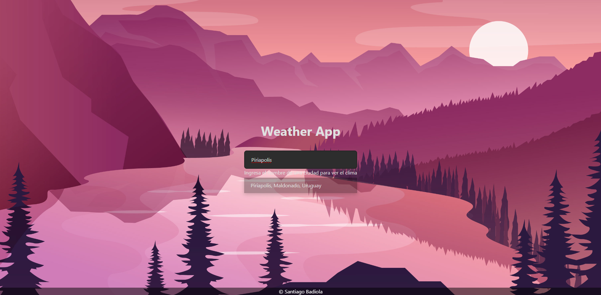
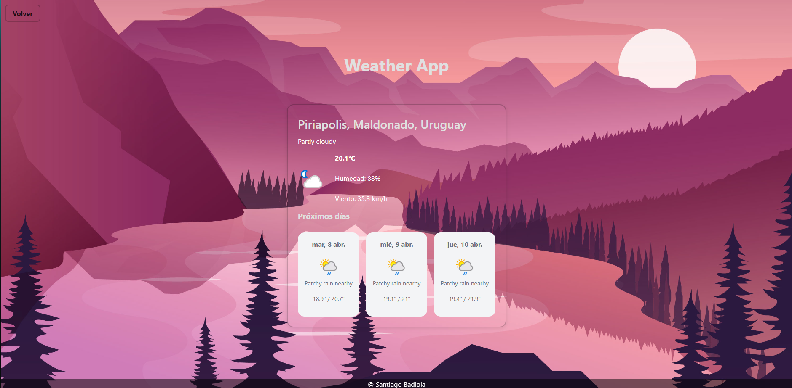

# 🌤️ Weather App

Aplicación del clima desarrollada con **React** + **Vite** que permite buscar ciudades con autocompletado y muestra la proyección del clima de forma clara y amigable.


## 🧩 Características

- 🔍 **Buscador con Autocompletado**: Encuentra ciudades fácilmente gracias a la búsqueda inteligente.
- 🌦️ **Pronóstico del Clima**: Visualiza la proyección del clima actual y futura.
- ⚡ **Rápido y Ligero**: Gracias a Vite, la aplicación carga súper rápido.

## 🖼️ Capturas de pantalla

### Búsqueda con autocompletado


### Pronóstico extendido


## 🛠️ Tecnologías utilizadas

- [React](https://reactjs.org/)
- [Vite](https://vitejs.dev/)
- [API del clima](https://www.weatherapi.com) <!-- Reemplaza si usás otra -->

### 🔑 Configuración de API
Asegúrate de tener una API Key válida en Weather Api y colócala en el archivo weatherService.js
-> const API_KEY = ""; // Clave de API proporcionada por Weather Api, hay que logearse

## ⚙️ Instalación y ejecución local

```bash
# Clonar el repositorio
git clone https://github.com/SantiagoBadiola2002/WeatherApp

# Ingresar al directorio del proyecto
cd ClimaApp

# Instalar las dependencias
npm install

# Ejecutar la aplicación en entorno de desarrollo
npm run dev


